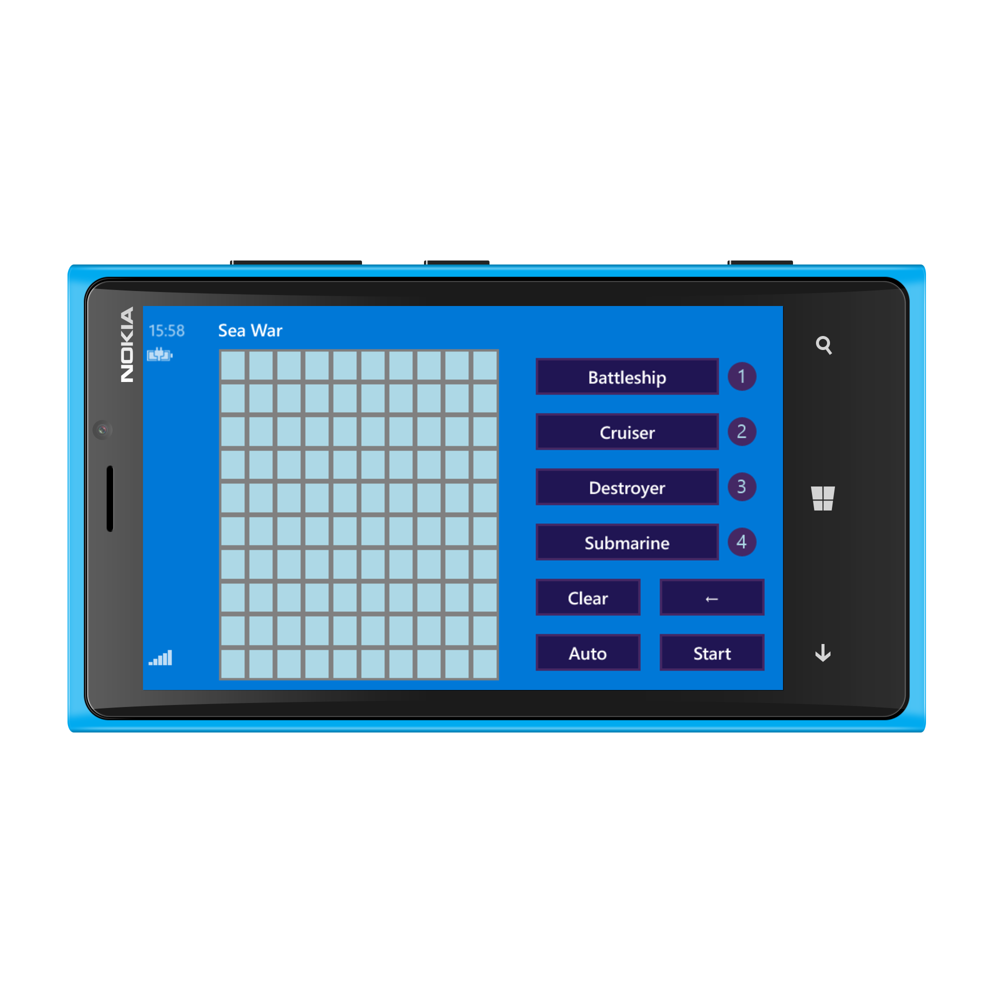
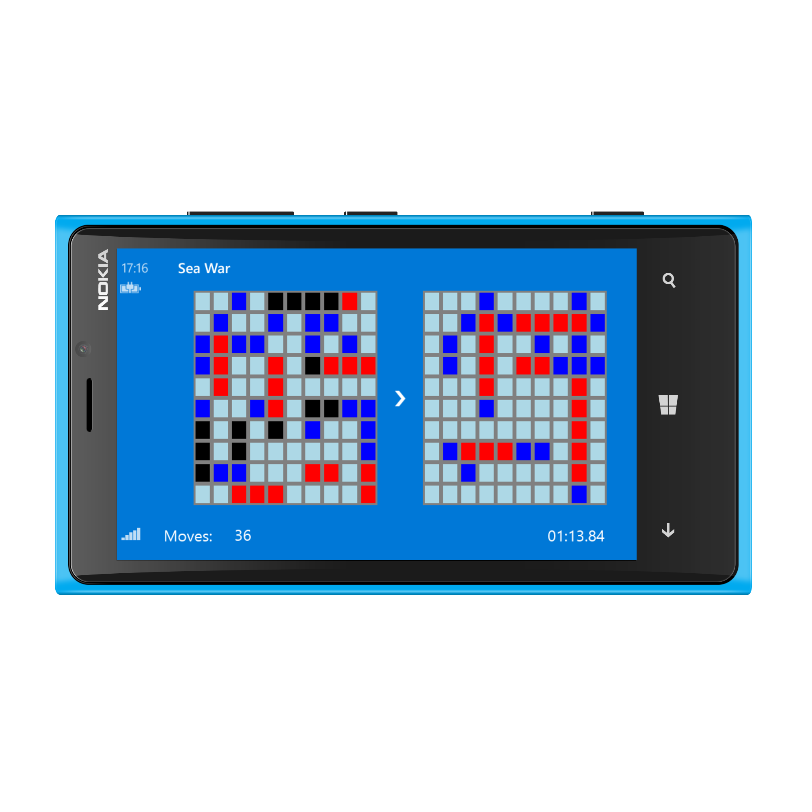
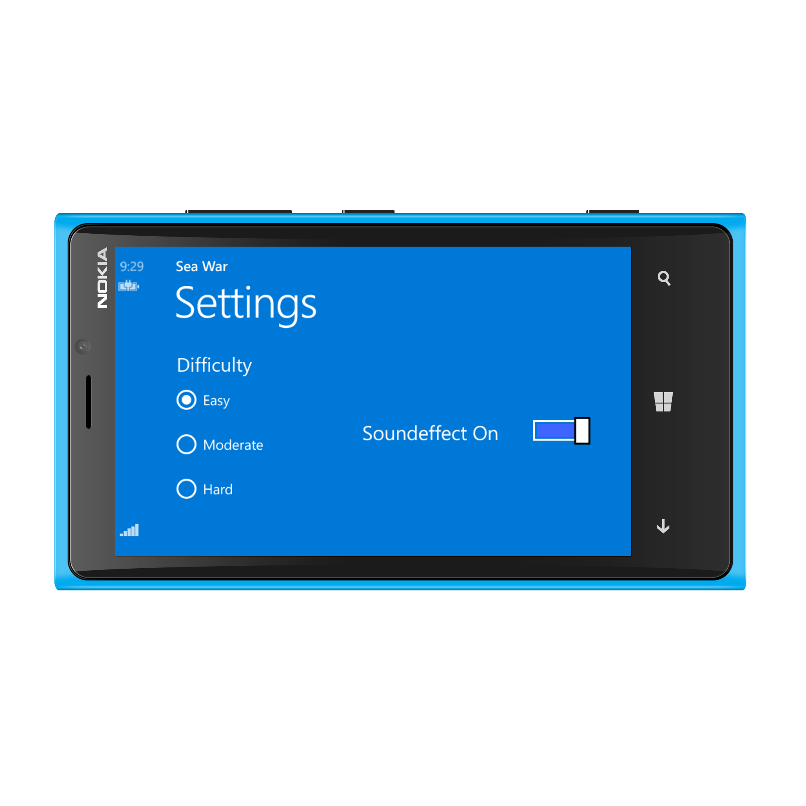

# SeaWar for Windows Phone 8

This game is an adaption of the classic game Battleships. 

## How to play 

- Select ship you want to place and tap on a position on the grid. 
    - Ships can be rotated using the arrow button. 
    - It is also possible to use the auto-placement function. 
- After clicking the start button, select coordinates on the grid of your opponent.
- Try to sink your opponent's fleet!

It is possible to play the game in three difficulties. Furthermore, the respective highscore is saved. 

## User Interface

### Placement

  
  

### Game

### Settings

